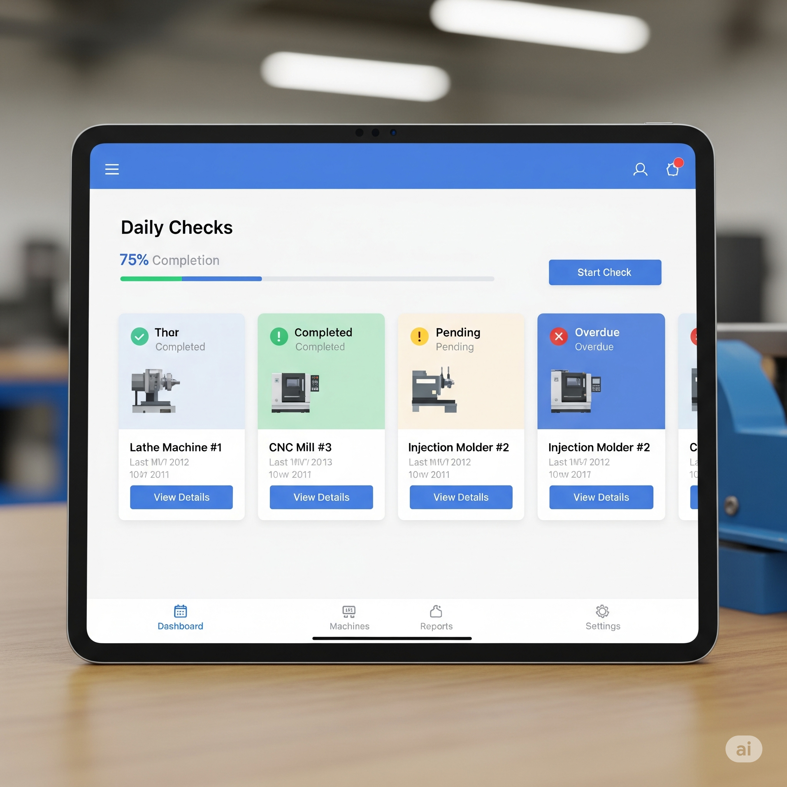

# Sanelise Matanzima — Portfolio

**IT Support Associate | Psychology Graduate | Emerging AI Innovator**

Welcome to my personal portfolio! I design ethical, human-centered AI solutions that combine behavioral insight with technical expertise. My work focuses on creating impactful tools and platforms for education, career development, and technology-driven initiatives.

---

## About Me

I am a versatile problem-solver with a strong foundation in psychology and hands-on experience in AI/ML development. My passion lies in combining behavioral insights with cutting-edge technology to design practical, ethical, and human-centered solutions.

With resilience and adaptability, I tackle complex challenges and deliver value-driven outcomes across education, employment, and technology initiatives. My goal is to apply interdisciplinary thinking to build inclusive, ethical, and impactful AI solutions that make a meaningful difference.

---

## Projects

### IT Master Chatbot

**Description:** Conversational AI learning companion for beginners.  
**Tech Stack:** Botpress, NLP, Conversation Design  
**Links:** [Live Demo](https://cdn.botpress.cloud/webchat/v2.4/shareable.html?configUrl=https://files.bpcontent.cloud/2025/05/16/10/20250516102421-ZCIOC18F.json) | [GitHub](https://github.com/Sanelise01/it-master-chatbot)

### Career Canvas Smart Build

**Description:** Professional document platform with responsive design for cross-device use.  
**Tech Stack:** React, TypeScript, Tailwind CSS  
**Links:** [Live Demo](https://lovable.dev/projects/2fdf0ff1-250f-4b5c-9e69-794e521563f8) | [GitHub](https://github.com/Sanelise01/career-canvas-smart-build)

### CreatiVerseAI

**Description:** AI-powered creative writing tool generating poems, stories, and prompts using LLaMA 3.3 and Groq API.  
**Tech Stack:** Groq API, LLaMA 3.3, Python, Streamlit  
**Links:** [Live Demo](https://cloud.flowiseai.com/chatbot/d4baf847-e9e1-4de2-9a22-c910eec44299) | [GitHub](https://github.com/Sanelise01/creativerseai)

### Fairness Audit Wizard

**Description:** Analytical tool for bias detection in ML models with dashboards and mitigation insights.  
**Tech Stack:** Python, Pandas, Scikit-learn, Plotly  
**Links:** [Live Demo](https://lovable.dev/projects/58f62fa0-cadc-42b7-9d05-3732e176e4ab) | [GitHub](https://github.com/Sanelise01/fairness-audit-wizard)

### Machine Daily Check Prototype

**Description:** Tablet-friendly UX/UI prototype streamlining industrial machine maintenance checks.  
**Tech Stack:** Figma, UX Design, Prototyping  
**Links:** [Live Demo](https://www.figma.com/proto/4l9za9IJtBn06GS4tPwqfj/Machine-Daily-Check_Prototype?node-id=13-3&p=f&t=MxOoZKrUt6grOVLa-1&scaling=scale-down&content-scaling=fixed&page-id=0%3A1&starting-point-node-id=13%3A3) | [GitHub](https://github.com/Sanelise01/machine-daily-check-prototype)

---

## Skills & Competencies

### Technical Skills
- Python, OpenAI API, Supabase, Botpress, Flowise AI  
- React, TypeScript, Tailwind CSS  
- SQL, Git, Figma, Human-Centered Design  

### Core Competencies
- Problem-solving  
- Collaboration  
- Communication  
- Presentation  
- Critical Thinking  
- Adaptability

---

## Contact Me

[Email](mailto:sanelisematanzima@gmail.com) | [GitHub](https://github.com/Sanelise01) | [LinkedIn](https://linkedin.com/in/sanelise-matanzima) | [Portfolio](https://Sanelise01.github.io/sanelise-portfolio/)  
[Download CV](SmartResume.pdf)

---

&copy; 2025 Sanelise Matanzima. All rights reserved.

 
